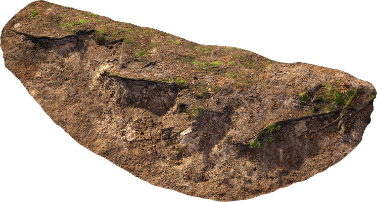
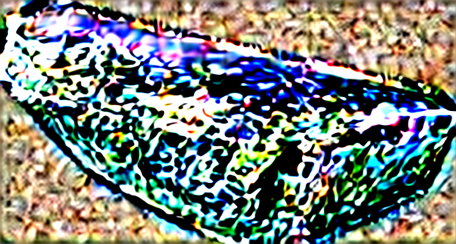
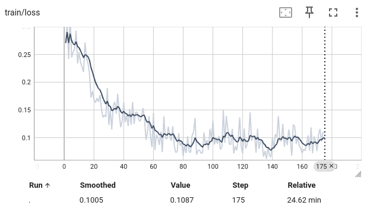

The purpose of this repository is implement the idea from the paper: <Boosting 3D Object Generation through PBR Materials> ([github](https://github.com/snowflakewang/PBR_Boost_3DGen)) 

This is the learning process representation, not commercial use.

## Fine Tune Stable Diffusion
**Goal:** Fine-tune the Stable Diffusion model to predict Albedo maps from Beauty renders by modifying the UNet component.  (Refer to the paper 4.1 Albedo and Normal Estimation)

Since the original authors did not release training code and their implementation is built on top of the Marigold project, I re-implemented the training and inference pipeline as follows:
- `src/trainer/marigold_trainer.py`: Training pipeline based on the Marigold project (which originally outputs depth).
- `albedo_pipeline.py`: Adapted from [paper author's code](https://github.com/snowflakewang/PBR_Boost_3DGen/blob/main/albedo_mesh_gen/MonoAlbedo/albedo_pipeline.py), modified to fit my dataset and training setup.
- `src/util/dataset.py`: Dataloader for my preprocessed Megascan dataset.
- `albedo_infer.py`: Inference script that put everything together.
- `train.yaml`

Due to computational limitations (training on a local RTX 5090), I used a 27 image-set dataset and limited the training to 200 iterations.

**Note:** This project was developed before the release of Marigold Multimodal version. At the time of development, predicting Albedo was not available in the Marigold repository. Please refer to this commit [Marigold](https://github.com/prs-eth/Marigold/tree/62413d56099d36573b2de1eb8c429839734b7782)

**What it produce now:**
Input: 

Output:

**Loss**:

## Dataset preparation

Command line: python batch_process.py --asset_folder ./src_assets --hdri_path ./HDRI/meadow_2_4k.exr --output_dir ./output --num_angles 6 --res 256

Batch render Megascan assets in the Blender and render out Beauty pass and Albedo pass with 6 random angles and resolution 256. A "filename_lst.txt" file also generated for the training in the next step.

Output_Folder
-- Albedo
    -- xxx_angle1.png
    -- xxx_angle2.png
        ...
-- Beauty
    -- xxx_angle1.png
    -- xxx_angle2.png
        ...
--filename_lst.txt

The dataset I am using is from Megascan (legacy version). The script load assets in the blender, render from here and produce Beauty, Albedo and Normal layers. 

I developed custom scripts to automate dataset generation--automate the process of importing Megascans (legacy) assets into Blender and batch rendering multi-view outputs (Beauty, Albedo, Normal).

## Training

cd MonoSD/Marigold
python ./training.py

Check the tensorboard:
tensorboard --logdir ./output/train/tensorboard

15gb VRAM required

