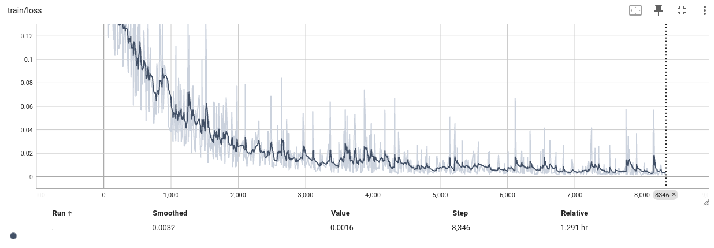
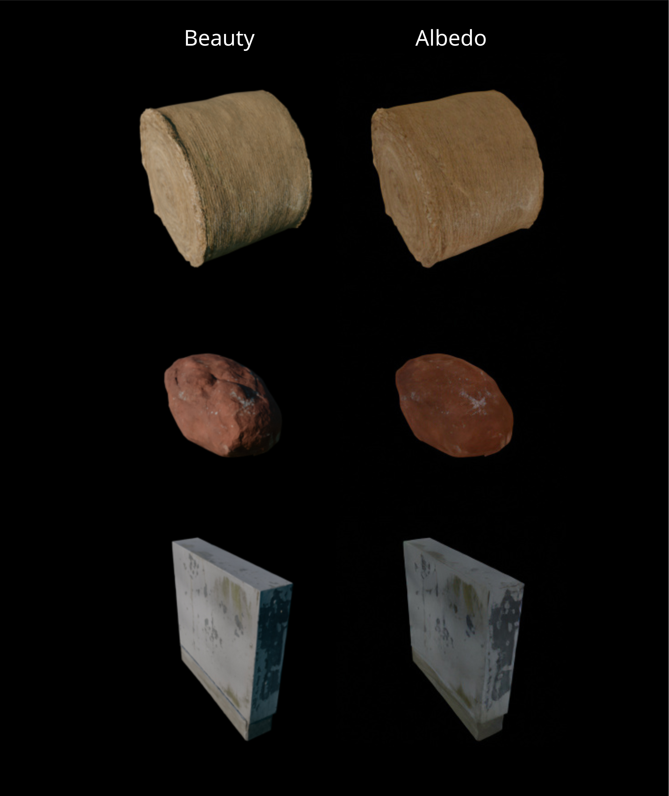

**This project aims to demonstrate the learning process by re-implementing the idea from the paper: <[Boosting 3D Object Generation through PBR Materials](https://snowflakewang.github.io/PBR_Boost_3DGen/)> ([github](https://github.com/snowflakewang/PBR_Boost_3DGen))**


# Beauty2Albedo
## Goal:
Fine-tune the Stable Diffusion model to predict Albedo maps from Beauty renders by modifying the UNet component.  (Re-implement idea from the paper [4.1 Albedo and Normal Estimation](https://arxiv.org/pdf/2411.16080))


## Project overview:
**Dataset preparation**:
The dataset originates from the Megascan library. I provide a Blender Python script that batch-loads and renders Megascan assets, producing paired datasets consisting of Beauty and Albedo passes.

**Training and Inference**:
I adapted the Marigold training code to work with my generated dataset, changing the original objective from predicting depth (from the Beauty pass) to predicting albedo (from Beauty pass). Then I made slight modifications to the pipeline and inference code from the [paper's implementation](https://github.com/snowflakewang/PBR_Boost_3DGen/tree/aaebb46b74c4f0d6d9edc8a2a7cc5a9144a43806/albedo_mesh_gen/MonoAlbedo) to integrate my trained weights.


- The training code is adapted from [Marigold](https://github.com/prs-eth/Marigold/tree/62413d56099d36573b2de1eb8c429839734b7782) 
- The pipeline and inference code is adapted from [the paper's code](https://github.com/snowflakewang/PBR_Boost_3DGen/tree/aaebb46b74c4f0d6d9edc8a2a7cc5a9144a43806/albedo_mesh_gen/MonoAlbedo)


**Training Details**:
Ran on Linux machine (Rocky) with one NVIDIA RTX 5090, CUDA version 12.9.<br>
Used 33 Megascan assets, each rendered from 6 random angles, generating 198 dataset pairs. The training ran for 8000 iterations, which convergence observed around 5000 iterations. Training and inference resolution: 256x256.

**Note:** This project was developed before the release of Marigold Multimodal version. At the time of development, predicting Albedo was not available in the Marigold repository. Please refer to this [Marigold commit](https://github.com/prs-eth/Marigold/tree/62413d56099d36573b2de1eb8c429839734b7782). The weights produced here are only the result of a small-scale experiment. They are not suitable for general use and are included solely for demonstration of the training process.

## How to use:
1. Download the repository: 

```bash
git clone https://github.com/junyiwuu/Beauty2Albedo.git
```

2. 
```bash
conda env create -f environment.yml
conda activate Beauty2Albedo
cd Beauty2Albedo
```

### Try the weight:

1. **[Download weights](https://huggingface.co/WuJunyi/Beauty2Albedo/tree/main)** and put them in `Beauty2Albedo/MonoSD/safetensors` or your customized path
2. 
```bash
cd ./MonoSD/Marigold/marigold
```
3. 
```bash
python albedo_infer.py --src_path <your_beauty_image> --dst_path <output_path> --weights ../../safetensors
```
(or you can replace the input_weights to where you download the weights)


- Example:     
```bash
python albedo_infer.py --src_path ../../test_images/rgb_images/rlCay.png  --dst_path ../../test_images/infer_images/rlCay_inferAlbedo.png --weights ../../safetensors
```
 


### Train on your own dataset
#### Dataset preparation
I assume you downloaded the assets from the Megascan library, so the asset folder follows the same structure as the original Megascan download. The script does not support assets that contain multiple variants (VARs) within a single asset folder.

1. 
```bash
python ./Megascan_Processing/batch_process.py --asset_folder <your_megascan_assets_folder> --hdri_path <you_HDRI_path> --output_dir <output_folder> --num_angles 6 --res 256
```

Description: Batch render Megascan assets in the Blender and render out Beauty pass and Albedo pass with 6 random angles and resolution 256. "filename_lst" and "filename_lst_val" files are generated at the same time.
- filename_lst: datasets that will be used for training
- filename_lst_val: datasets that will be used for evaluation during the training. Currently it random select 10 pairs from training dataset. You can modify and input your own evaluation datasets.

The dataset folder for the training should looks like this:
```
Dataset_Folder
-- Albedo
    -- xxx_angle1.png
    -- xxx_angle2.png
        ...
-- Beauty
    -- xxx_angle1.png
    -- xxx_angle2.png
        ...
--filename_lst
--filename_lst_val
```


#### Training
Modify yaml file in *Beauty2Albedo/MonoSD/Marigold/config/train.yaml*  if you need.

1.
```bash
cd Beauty2Albedo/MonoSD/Marigold
python ./training.py --training_data <your_dataset_folder> --config ./config/train.yaml
```
- Example: 

```bash
python ./training.py --training_data ../../Megascan_Processing/output --config ./config/train.yaml
```


**Check the tensorboard**:
```bash
tensorboard --logdir ./output/train/tensorboard
```


#### Inference

```bash 
python ./MonoSD/Marigold/marigold/albedo_infer.py --src_path <your_beauty_image> --dst_path <output_path>
```
(It automatically read the latest saved weight from your training)

- Example:
```bash
python albedo_infer.py --src_path ../../test_images/rgb_images/rlCay.png  --dst_path ../../test_images/infer_images/rlCay_inferAlbedo.png
```


## Output:
**Loss**:


**Inference**:



**Disclaimer**: The released weights were trained on a limited amount of rendered data generated from licensed Megascans assets. The weights do not contain or allow reconstruction of the original Megascans textures. Users must obtain assets through their own Quixel accounts to reproduce the dataset generation process.

