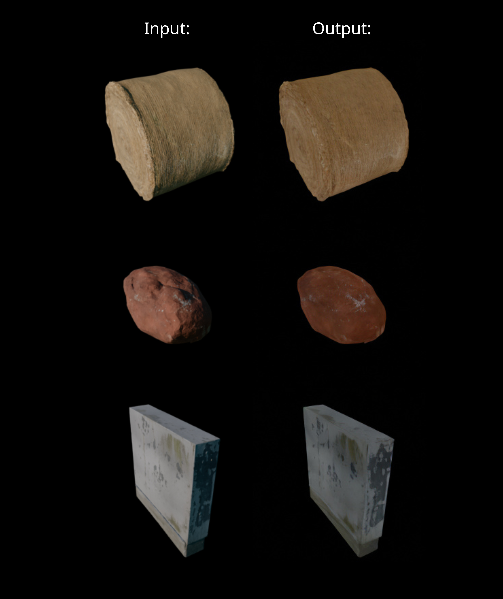

**This project aims to demonstrate the learning process by re-implementing the idea from the paper: <[Boosting 3D Object Generation through PBR Materials](https://snowflakewang.github.io/PBR_Boost_3DGen/)> ([github](https://github.com/snowflakewang/PBR_Boost_3DGen))**


# Beauty2Albedo
## Goal:
Fine-tune the Stable Diffusion model to predict Albedo maps from Beauty renders by modifying the UNet component.  (Re-implement idea from the paper [4.1 Albedo and Normal Estimation](https://arxiv.org/pdf/2411.16080))


## Project overview:
**Dataset preparation**:
The original dataset is from Megascan library. I provide a Blender python script to batch-load and render the Megascan assets, and generate paired datasets (Beauty pass and Albedo pass). 

**Training and Inference**:
I adapted the Marigold training code to train on my generated dataset, modifying the original training logic from predicting Depth (from Beauty) to predicting Albedo (from Beauty pass). Then I made slight modifications to the pipeline and inference code from the [paper's implementation](https://github.com/snowflakewang/PBR_Boost_3DGen/tree/aaebb46b74c4f0d6d9edc8a2a7cc5a9144a43806/albedo_mesh_gen/MonoAlbedo) to integrate my trained weights.


- The training code is adpated from [Marigold](https://github.com/prs-eth/Marigold/tree/62413d56099d36573b2de1eb8c429839734b7782) 
- The pipeline and inference code is adapted from [the paper's code](https://github.com/snowflakewang/PBR_Boost_3DGen/tree/aaebb46b74c4f0d6d9edc8a2a7cc5a9144a43806/albedo_mesh_gen/MonoAlbedo)


**Training Details**:
Ran on Linux machine (Rocky) with one NVIDIA RTX 5090, CUDA version 12.9.<br>
Used 33 Megascan assets, each rendered from 6 random angles, generating 198 dataset pairs. The training ran for 8000 iterations, which convergence observed around 5000 iterations. Training and inference resolution: 256x256.

**Note:** This project was developed before the release of Marigold Multimodal version. At the time of development, predicting Albedo was not available in the Marigold repository. Please refer to this [Marigold commit](https://github.com/prs-eth/Marigold/tree/62413d56099d36573b2de1eb8c429839734b7782).

## How to use:
1. Download the repository: `git clone https://github.com/junyiwuu/Beauty2Albedo.git`
2. `conda env create -f environment.yml`
3. `conda activate Beauty2Albedo`
4. `cd Beauty2Albedo`

### Try the weight:

1. **[Download weights](https://huggingface.co/WuJunyi/Beauty2Albedo/tree/main)** and put them in `Beauty2Albedo/MonoSD/safetensors` or your customized path
2. `cd ./MonoSD/Marigold/marigold`
3. `python albedo_infer.py --src_path <your_beauty_image> --dst_path <output_path> --weights ../../safetensors` (or you can replace the input_weights to where you download the weights)
    - Example: `python albedo_infer.py --src_path ../../test_images/rgb_images/rlCay.png  --dst_path ../../test_images/infer_images/rlCay_inferAlbedo.png --weights ../../safetensors`
 


### Train on your own dataset
#### Dataset preparation
We assume you donwload from Megascan library, so the asset folder has the same structure as from Megascan downloaded asset.

1. `python ./Megascan_Processing/batch_process.py --asset_folder <your_megascan_assets_folder> --hdri_path <you_HDRI_path> --output_dir <output_folder> --num_angles 6 --res 256`

Description: Batch render Megascan assets in the Blender and render out Beauty pass and Albedo pass with 6 random angles and resolution 256. "filename_lst" and "filename_lst_val" files are generated at the same time.
- filename_lst: datasets that will be used for training
- filename_lst_val: datasets that will be used for evaluation during the training. Currently it random select 10 pairs from training dataset. You can modify and input your own evaluation datasets.

The dataset folder for the training should looks like this:
```
Dataset_Folder
-- Albedo
    -- xxx_angle1.png
    -- xxx_angle2.png
        ...
-- Beauty
    -- xxx_angle1.png
    -- xxx_angle2.png
        ...
--filename_lst
--filename_lst_val
```


#### Training
Modify yaml file in *Beauty2Albedo/MonoSD/Marigold/config/train.yaml*  if you need.

1. `cd Beauty2Albedo/MonoSD/Marigold`
2. `python ./training.py --training_data <your_dataset_folder> --config ./config/train.yaml`
    - Example: `python ./training.py --training_data ../../Megascan_Processing/output --config ./config/train.yaml`

**Check the tensorboard**:
`tensorboard --logdir ./output/train/tensorboard`


#### Inference
1. `python ./MonoSD/Marigold/marigold/albedo_infer.py --src_path <your_beauty_image> --dst_path <output_path>` (It automatically read the latest saved weight from your training)
    - Example: `python albedo_infer.py --src_path ../../test_images/rgb_images/rlCay.png  --dst_path ../../test_images/infer_images/rlCay_inferAlbedo.png`


## Output:
**Loss**:


**Inference**:



